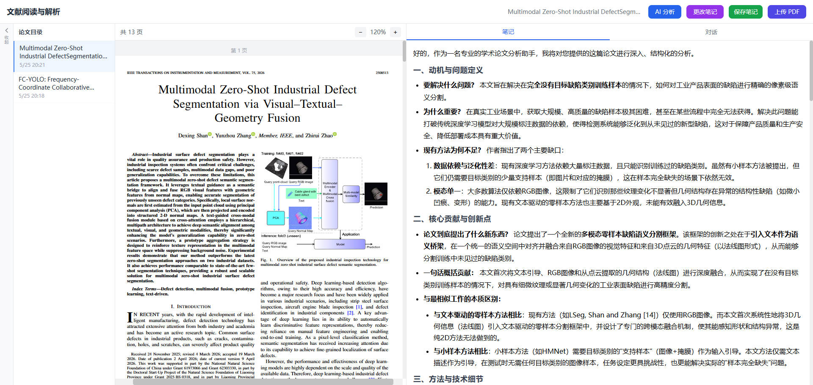

# 📖 Paper Reading Web - 文献阅读与解析工具

一个基于 AI 的学术论文阅读与智能分析平台。上传 PDF 论文后，AI 自动提取全文内容并生成结构化的七章阅读笔记，支持在线编辑笔记、PDF 浏览以及基于论文内容的问答对话。



## ✨ 核心功能

- **📄 PDF 上传与解析** — 支持拖拽或点击上传 PDF，自动提取论文全文文本
- **👁️ 在线 PDF 阅读** — 基于 react-pdf 的连续滚动阅读器，支持 50% ~ 300% 缩放
- **🤖 AI 智能分析** — 调用 DeepSeek 大模型，流式生成结构化的七章论文解析笔记：
  1. 研究动机与问题定义
  2. 核心贡献与创新点
  3. 方法与技术细节
  4. 实验设计与验证
  5. 分析与洞见
  6. 局限性与未来工作
  7. 领域定位与影响
- **✏️ 笔记编辑** — 支持 Markdown 格式的笔记查看与编辑，自动保存（2 秒防抖）
- **💬 论文问答** — 基于论文全文和笔记内容的 AI 对话，可针对论文内容自由提问（同样流式回复）
- **📚 历史记录** — 侧边栏展示所有已上传论文，点击即可切换，支持重复文件检测（SHA-256 哈希）
- **🔄 重复上传检测** — 同一篇论文重复上传时提示用户，可选择打开已有记录或重新分析

## 🛠️ 技术栈

| 层级 | 技术 | 说明 |
|------|------|------|
| **前端框架** | React 18 + TypeScript | 函数组件 + Hooks |
| **构建工具** | Vite 6 | 开发代理到后端 3001 端口 |
| **CSS** | Tailwind CSS 3 | 实用优先的原子化 CSS |
| **PDF 渲染** | react-pdf 9 | 基于 pdfjs-dist 的 React 封装 |
| **Markdown 渲染** | react-markdown + remark-gfm | 渲染 AI 生成的 Markdown 笔记 |
| **后端框架** | Express 4 + TypeScript | RESTful API + SSE 流式响应 |
| **AI 服务** | OpenAI SDK → DeepSeek API | 兼容 OpenAI 协议的 DeepSeek v4-pro 模型 |
| **PDF 解析** | pdf-parse | 服务端提取 PDF 文本 |
| **文件上传** | multer | 50MB 限制，仅允许 PDF 格式 |
| **数据存储** | 文件系统 | PDF、笔记(.md)、元数据(.meta.json) 均存储在 `uploads/` 目录 |
| **开发工具** | concurrently + tsx | 前后端并行启动 + 热重载 |

## 📁 项目结构

```
paper-reading-web/
├── src/
│   ├── client/                    # React 前端
│   │   ├── main.tsx               # 应用入口
│   │   ├── App.tsx                # 主组件（状态管理、布局）
│   │   ├── index.css              # Tailwind 指令 + 组件样式
│   │   ├── types/index.ts         # TypeScript 类型定义
│   │   ├── services/api.ts        # API 调用封装（上传、分析流、聊天流、笔记）
│   │   ├── hooks/useAutoSave.ts   # 自动保存 Hook（2s 防抖）
│   │   └── components/
│   │       ├── FileUploader.tsx   # 文件上传组件
│   │       ├── PDFViewer.tsx      # PDF 阅读器（连续滚动 + 缩放）
│   │       ├── NoteEditor.tsx     # 笔记查看/编辑组件
│   │       ├── ChatPanel.tsx      # AI 问答对话面板
│   │       ├── Sidebar.tsx        # 论文历史侧边栏
│   │       ├── TabSwitcher.tsx    # 笔记/对话标签切换
│   │       └── ConfirmDialog.tsx  # 通用确认弹窗
│   └── server/                    # Express 后端
│       ├── index.ts               # 服务入口（端口管理、静态文件服务）
│       ├── middleware/upload.ts   # Multer 上传中间件
│       ├── routes/
│       │   ├── pdf.ts             # PDF CRUD、重复检测、全文搜索
│       │   ├── analyze.ts         # AI 分析接口（SSE 流式）
│       │   ├── chat.ts            # AI 问答接口（SSE 流式）
│       │   └── notes.ts           # 笔记读写接口
│       └── services/
│           ├── pdfService.ts      # PDF 文本提取、哈希计算、元数据管理
│           ├── deepseekService.ts # DeepSeek API 调用（OpenAI SDK）
│           └── noteService.ts     # 笔记文件读写
├── pic/
│   └── whole-page.jpg             # 项目截图
├── uploads/                       # 数据存储目录（已 gitignore）
│   ├── *.pdf                      # 上传的论文 PDF
│   ├── *.meta.json                # 论文元数据
│   └── notes/*.md                 # AI 生成的笔记
├── vite.config.ts                 # Vite 配置（路径别名、代理）
├── tailwind.config.js
├── tsconfig.json
├── package.json
└── test.mjs                       # 集成测试
```

## 🚀 本地部署指南

### 前置要求

- **Node.js** >= 18.x
- **npm** >= 9.x
- 一个 **DeepSeek API Key**（[前往 DeepSeek 官网获取](https://platform.deepseek.com/api_keys)）

### 第一步：克隆项目

```bash
git clone https://github.com/你的用户名/paper-reading-web.git
cd paper-reading-web
```

### 第二步：安装依赖

```bash
npm install
```

### 第三步：配置 API Key

在项目根目录创建 `.env` 文件：

```bash
echo "DEEPSEEK_API_KEY=你的DeepSeek_API_Key" > .env
```

或者手动创建 `.env` 文件，写入：

```
DEEPSEEK_API_KEY=sk-xxxxxxxxxxxxxxxxxxxxxxxxxxxxxxxx
```

> ⚠️ **注意**：`.env` 文件已在 `.gitignore` 中，不会被提交到 Git 仓库。请勿将 API Key 硬编码在代码中。

### 第四步：启动开发服务器

```bash
npm run dev
```

该命令会同时启动：
- **前端开发服务器**：`http://localhost:5173`（Vite，支持热更新）
- **后端 API 服务**：`http://localhost:3001`（Express，支持热重载）

打开浏览器访问 `http://localhost:5173` 即可使用。

### 第五步：运行测试（可选）

```bash
# 先在一个终端启动后端服务
npm run dev:server

# 在另一个终端运行集成测试
node test.mjs
```

### 生产环境部署

```bash
# 1. 设置环境变量
export DEEPSEEK_API_KEY=你的DeepSeek_API_Key
export NODE_ENV=production

# 2. 构建前端
npm run build

# 3. 启动生产服务（Express 同时提供静态文件 + API）
npm start
```

生产环境下，Express 会：
- 从 `dist/client/` 提供构建后的前端静态文件
- 对于非 API 路径，返回 `index.html`（支持 SPA 路由）
- 启动在 **3001** 端口（如果端口被占用会自动更换可用端口）

> 建议在生产环境中使用 **Nginx** 或 **Caddy** 作为反向代理，将 80/443 端口转发到 `localhost:3001`，并配置 HTTPS。

## 🔌 API 接口概览

| 方法 | 路径 | 说明 |
|------|------|------|
| `GET` | `/api/pdf` | 获取所有已上传论文列表 |
| `POST` | `/api/pdf/upload` | 上传 PDF（FormData, field: `pdf`） |
| `GET` | `/api/pdf/:id` | 获取论文元数据 |
| `GET` | `/api/pdf/:id/file` | 获取 PDF 文件（直接返回文件流） |
| `GET` | `/api/pdf/:id/text` | 获取论文提取文本（支持 `?load=1` 重新提取） |
| `GET` | `/api/pdf/search?q=关键词` | 在所有论文中搜索文本 |
| `POST` | `/api/analyze` | AI 分析论文（SSE 流式响应） |
| `POST` | `/api/chat` | AI 问答对话（SSE 流式响应） |
| `GET` | `/api/notes/:id` | 获取笔记内容 |
| `POST` | `/api/notes/:id` | 保存/更新笔记 |

## 📝 使用流程

1. 点击 **"上传论文"** 按钮或拖拽 PDF 文件到上传区域
2. 上传成功后 PDF 显示在左侧阅读区，可使用缩放控件调整视图
3. 点击 **"AI 分析"** 按钮，AI 开始实时生成结构化笔记（流式展示，无需等待全部完成）
4. 笔记生成后可在右侧面板查看，点击 **"编辑"** 可手动修改并自动保存
5. 切换到 **"对话"** 标签，可针对论文内容向 AI 提问
6. 左侧 **论文历史** 侧边栏可随时切换之前上传的论文

## 📄 开源协议

MIT License
